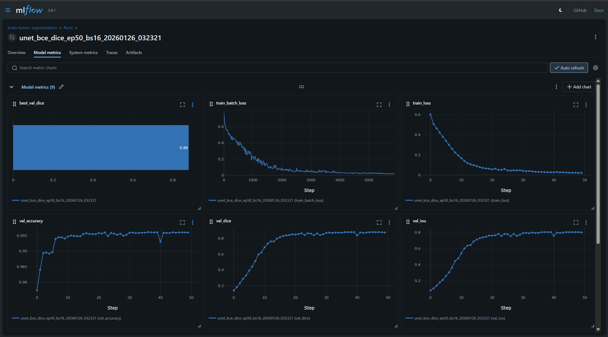
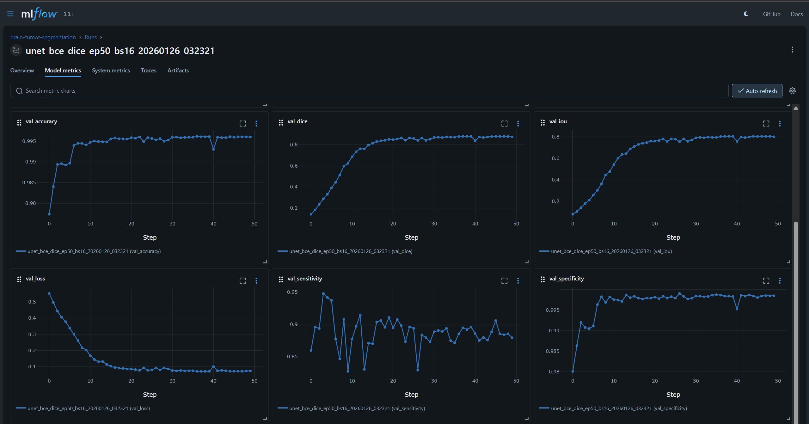
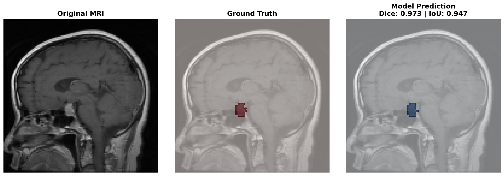

# Brain Tumor Segmentation & Classification

[](https://www.python.org/downloads/)
[](https://pytorch.org/)

> **Note:** Original research notebooks preserved in [`archive/original-notebooks`](../../tree/archive/original-notebooks) branch.

## Project Overview

End-to-end PyTorch pipeline for brain tumor segmentation and classification from MRI scans.

**Architecture:** Raw MRI → Preprocessing → U-Net Segmentation → Feature Extraction → Classification

## Results

**Trained U-Net Model Performance** (50 epochs on 2,500+ brain MRI scans):

| Metric | Score |
|--------|-------|
| **Validation Dice** | **87.95%** |
| **Validation IoU** | **79.93%** |
| **Validation Accuracy** | **99.60%** |
| **Validation Sensitivity** | **87.92%** |
| **Validation Specificity** | **99.84%** |

**Training Configuration:**
- Loss Function: BCEDiceLoss (α=0.5)
- Optimizer: Adam (lr=1e-4)
- Batch Size: 16
- Image Size: 128×128
- Experiment Tracking: MLflow

<details>
<summary>View Training Curves</summary>




*Smooth convergence with no overfitting. Training loss: 0.021 | Validation loss: 0.074*
</details>


## 🏗️ Tech Stack

- **Deep Learning:** PyTorch 2.0
- **Preprocessing:** OpenCV, scikit-image
- **Experiment Tracking:** MLflow
- **Testing:** pytest with coverage
- **CI/CD:** GitHub Actions (planned)

## 📁 Project Structure

```
brain-tumor-segmentation/
├── src/
│   ├── data/              # Data loading & preprocessing
│   ├── models/            # PyTorch U-Net, metrics, losses
│   ├── features/          # Feature extraction (LBP, Gabor, GLCM)
│   ├── classification/    # Gradient Boosting classifier
│   ├── training/          # Training utilities
│   └── inference/         # End-to-end pipeline
├── experiments/           # MLflow training scripts
├── tests/                # Unit tests (pytest)
└── notebooks/            # Demo notebooks

Original research: archive/original-notebooks branch
```

## 🚀 Quick Start

```bash
# Clone
git clone https://github.com/Abhinawap/brain-tumor-detection-ml.git
cd brain-tumor-detection-ml

# Install dependencies
pip install -r requirements.txt

# Train model
python experiments/train_segmentation.py \
  --epochs 50 \
  --batch-size 16 \
  --lr 1e-4 \
  --device cuda

# View results in MLflow
mlflow ui
```

## 🎨 Demo Notebook

See the model in action: **[notebooks/demo_segmentation.ipynb](notebooks/demo_segmentation.ipynb)**

The notebook demonstrates:
- Loading trained model from checkpoint
- Running inference on brain MRI images
- Side-by-side visualization: Original | Ground Truth | Prediction
- Quantitative metrics calculation (Dice, IoU)
- Performance evaluation across multiple samples

**Sample output:**



## 🧪 Development Status

**Current Phase:** ✅ Segmentation pipeline complete  
**Next Milestone:** Create inference demo notebook + feature extraction module  
**Last Training Run:** January 26, 2026

### Roadmap

- [x] Preprocessing pipeline (Wiener, CLAHE, cropping)
- [x] PyTorch U-Net architecture
- [x] Custom metrics (Dice, IoU) & losses
- [x] Training script with MLflow
- [x] Unit tests (pytest)
- [ ] Feature extraction module (in progress)
- [ ] Classification pipeline (planned)
- [ ] Inference demo notebook (next)
- [ ] GitHub Actions CI/CD (planned)

## Academic Context

This project evolved from a Pattern Recognition course final project (June 2025).

**Refactoring demonstrates:**
- Research-to-production code transformation
- ML engineering best practices
- Experiment tracking and reproducibility
- Comprehensive testing and CI/CD

**Original academic notebooks:** [`archive/original-notebooks`](../../tree/archive/original-notebooks)

## 📄 License

MIT

---

**Last Updated:** February 11, 2026 
**Status:** ✅ Segmentation pipeline functional | 🚧 Classification pipeline in development
