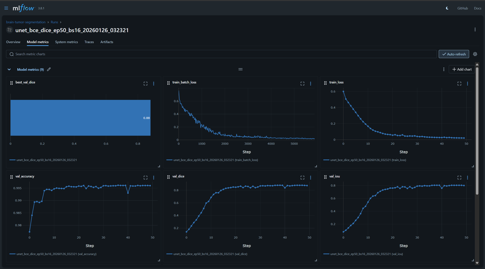
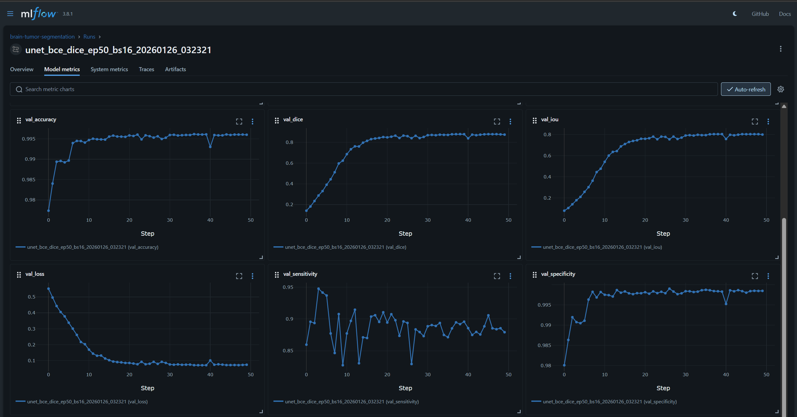
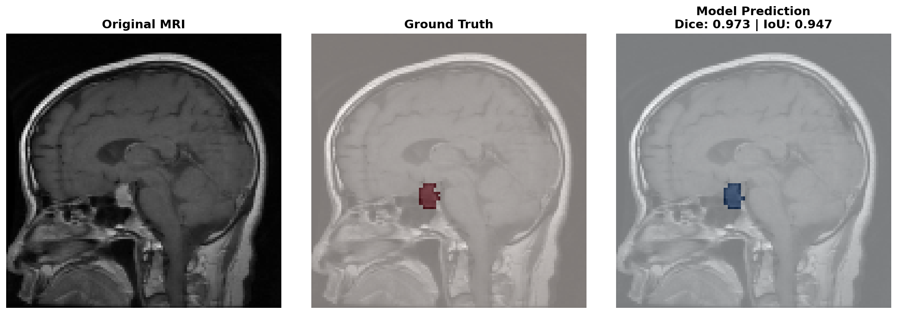

# Brain Tumor Segmentation & Classification

[](https://www.python.org/downloads/)
[](https://pytorch.org/)
[](https://github.com/Abhinawap/brain-tumor-detection-ml/actions)
[](https://opensource.org/licenses/MIT)
[](https://github.com/psf/black)


> **Note:** Original research notebooks preserved in [`archive/original-notebooks`](../../tree/archive/original-notebooks) branch.

## Project Overview

End-to-end PyTorch pipeline for brain tumor segmentation and classification from MRI scans.

**Architecture:** Raw MRI → Preprocessing → U-Net Segmentation → Feature Extraction → Classification

## Results

**Trained U-Net Model Performance** (50 epochs on 2,500+ brain MRI scans):

| Metric | Score |
|--------|-------|
| **Validation Dice** | **87.95%** |
| **Validation IoU** | **79.93%** |
| **Validation Accuracy** | **99.60%** |
| **Validation Sensitivity** | **87.92%** |
| **Validation Specificity** | **99.84%** |

**Training Configuration:**
- Loss Function: BCEDiceLoss (α=0.5)
- Optimizer: Adam (lr=1e-4)
- Batch Size: 16
- Image Size: 128×128
- Experiment Tracking: MLflow

<details>
<summary>View Training Curves</summary>




*Smooth convergence with no overfitting. Training loss: 0.021 | Validation loss: 0.074*
</details>

## What this project covers

Started as a Pattern Recognition course project, then refactored into a proper package. The main engineering work: modular PyTorch pipeline, MLflow experiment tracking, a pytest suite covering data loading, model forward passes, and metric calculations, and GitHub Actions CI that runs on every push.

## Tech Stack

- **Deep Learning:** PyTorch 2.0
- **Preprocessing:** OpenCV, scikit-image
- **Experiment Tracking:** MLflow
- **Testing:** pytest with coverage
- **CI/CD:** GitHub Actions (planned)

## Project structure

```
brain-tumor-segmentation/
├── src/
│   ├── data/              # Data loading & preprocessing
│   ├── models/            # PyTorch U-Net, metrics, losses
│   ├── features/          # Feature extraction (LBP, Gabor, GLCM)
│   ├── classification/    # Gradient Boosting classifier
│   ├── training/          # Training utilities
│   └── inference/         # End-to-end pipeline
├── experiments/           # MLflow training scripts
├── tests/                # Unit tests (pytest)
└── notebooks/            # Demo notebooks

Original research: archive/original-notebooks branch
```

## Quick start

```bash
# Clone
git clone https://github.com/Abhinawap/brain-tumor-detection-ml.git
cd brain-tumor-detection-ml

# Install dependencies
pip install -r requirements.txt

# Train model
python experiments/train_segmentation.py \
  --epochs 50 \
  --batch-size 16 \
  --lr 1e-4 \
  --device cuda

# View results in MLflow
mlflow ui
```

## Demo Notebook

See the model in action: **[notebooks/demo_segmentation.ipynb](notebooks/demo_segmentation.ipynb)**

The notebook demonstrates:
- Loading trained model from checkpoint
- Running inference on brain MRI images
- Side-by-side visualization: Original | Ground Truth | Prediction
- Quantitative metrics calculation (Dice, IoU)
- Performance evaluation across multiple samples

**Sample output:**



## Development status

**Current Phase:** ✅ Segmentation pipeline complete  
**Next Milestone:** Create inference demo notebook + feature extraction module  
**Last Training Run:** January 26, 2026

### Roadmap

- [x] Preprocessing pipeline (Wiener, CLAHE, cropping)
- [x] PyTorch U-Net architecture
- [x] Custom metrics (Dice, IoU) & losses
- [x] Training script with MLflow
- [x] Unit tests (pytest)
- [x] Inference demo notebook
- [x] Example visualizations
- [x] GitHub Actions CI/CD
- [ ] Feature extraction module
- [ ] Classification pipeline

## Academic context

Started as a Pattern Recognition course final project (June 2025). The refactoring was mainly about taking working notebook code and reorganizing it into a testable, reproducible package with proper experiment tracking.

**Original academic notebooks:** [`archive/original-notebooks`](../../tree/archive/original-notebooks)

## License

MIT

---

**Last Updated:** February 11, 2026 
**Status:** Segmentation pipeline complete | Classification pipeline in development
