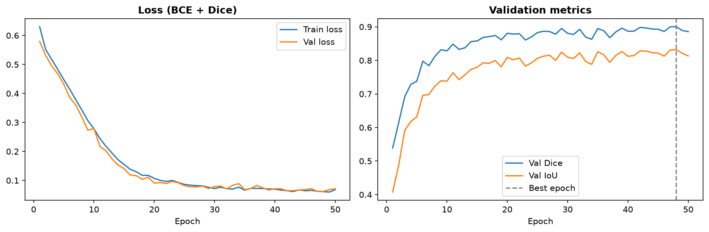
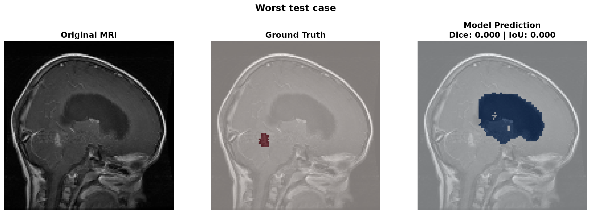
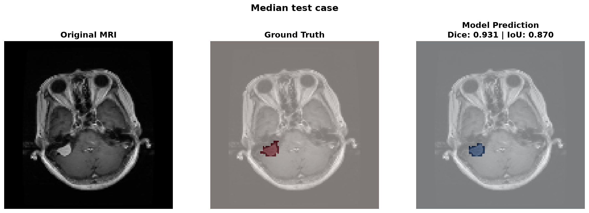
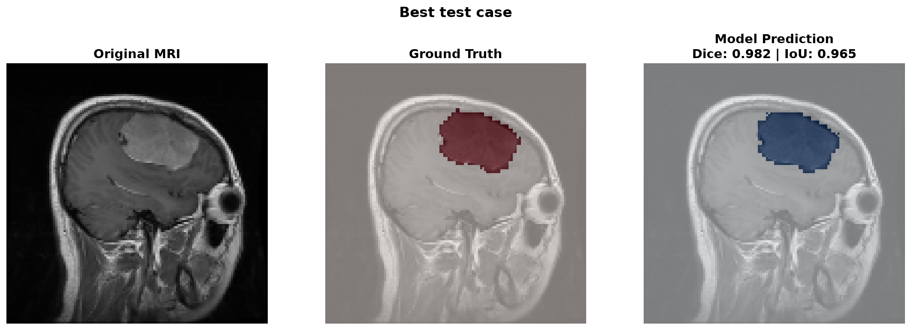

# Brain Tumor Segmentation (U-Net)

[](https://www.python.org/downloads/)
[](https://pytorch.org/)
[](https://github.com/Abhinawap/brain-tumor-detection-ml/actions)
[](https://opensource.org/licenses/MIT)
[](https://github.com/psf/black)


> **Note:** Original research notebooks preserved in [`archive/original-notebooks`](../../tree/archive/original-notebooks) branch.

## Project Overview

PyTorch pipeline for brain tumor segmentation on 2D MRI slices: a U-Net trained from scratch to predict a binary tumor mask.

**Pipeline:** MRI slice → resize to 128×128 → U-Net → tumor mask

`src/data/preprocessing.py` (Wiener-style denoising, CLAHE, cropping from the course project) is tested but not used in U-Net training.

**Data:** 2,349 2D MRI slices with tumor masks (glioma 649, meningioma 999, pituitary 701). 293 pituitary images ship without a mask and are skipped; the no-tumor class is excluded.

## Results

Held-out **test split** (352 images), best checkpoint chosen by validation Dice. All metrics use the prediction thresholded at 0.5.

| Metric | Test |
|--------|------|
| **Dice** | **88.77%** |
| IoU | 81.84% |
| Sensitivity | 89.41% |
| Specificity | 99.77% |

Validation Dice of the selected checkpoint: 90.03% (epoch 48). Split: 1,645 / 352 / 352 train/val/test (70/15/15), seed 42.

Per-image test Dice: median 93.1%; 13 of 352 images score below 50%, the worst at 0%.

Pixel accuracy (99.56%) isn't reported as a headline: most pixels are background, so an empty mask would also score highly.

**Training Configuration:**
- Loss Function: BCEDiceLoss (α=0.5)
- Optimizer: Adam (lr=1e-4)
- Epochs: 50, Batch Size: 16
- Image Size: 128×128
- Augmentation (training split only): horizontal/vertical flips, 90° rotations, brightness ×0.8–1.2, each with p=0.5
- Experiment Tracking: MLflow

<details>
<summary>View Training Curves</summary>



*Train and validation loss track each other closely (epoch 50: 0.068 vs 0.071). Validation Dice stays between 86% and 90% after about epoch 25.*
</details>

## What this project covers

Started as a Pattern Recognition course project, then refactored into a proper package. The main engineering work: modular PyTorch pipeline, MLflow experiment tracking, a pytest suite covering data loading, model forward passes, and metric calculations, and GitHub Actions CI that runs on every push.

## Tech Stack

- **Deep Learning:** PyTorch 2.0
- **Image processing:** OpenCV
- **Experiment Tracking:** MLflow
- **Testing:** pytest with coverage
- **CI/CD:** GitHub Actions

## Project structure

```
brain-tumor-detection-ml/
├── src/
│   ├── data/              # Dataset + augmentation; standalone preprocessing module
│   └── models/            # PyTorch U-Net, metrics, losses
├── experiments/           # MLflow training script
├── tests/                 # Unit tests (pytest)
├── notebooks/             # Demo notebook (test-split evaluation)
└── docs/                  # Training curves & example predictions

Original research: archive/original-notebooks branch
```

## Quick start

```bash
# Clone
git clone https://github.com/Abhinawap/brain-tumor-detection-ml.git
cd brain-tumor-detection-ml

# Install dependencies
pip install -r requirements.txt

# Train model (seeded split; evaluates the best checkpoint on the test split at the end)
python experiments/train_segmentation.py \
  --epochs 50 \
  --batch-size 16 \
  --lr 1e-4 \
  --seed 42 \
  --device cuda

# View results in MLflow
mlflow ui
```

## Demo Notebook

**[notebooks/demo_segmentation.ipynb](notebooks/demo_segmentation.ipynb)** loads the checkpoint and works only on the test split saved in it:
- Per-image Dice/IoU over the whole test split, with a histogram
- Side-by-side visualization: Original | Ground Truth | Prediction
- Training curves from the checkpoint history
- Worst, median and best test cases saved to `docs/inference_examples/`

**Sample outputs (worst / median / best test case):**


*Worst: the model segments the lateral ventricle and misses a small tumor.*





## Relation to the course report

`Group 3 - Final Report - Pattern Recognition Final Project.pdf` is the June 2025 group submission, kept unchanged. It differs from this repo:

- **92% F1 is a classification score.** It's the F1 (92.05%, Tab. 1 in the report) of a logistic regression classifier trained on handcrafted texture features (LBP, Gabor, GLCM) extracted from U-Net-segmented images. It is not a segmentation metric, and that classifier isn't in this repo.
- **The U-Net.** The report used a U-Net trained on external data ("pretrained"). This repo trains its own U-Net from scratch; the numbers above come only from that model.
- **"Excluding deep learning"** in the report's conclusion refers to the classifiers. The segmentation step did use a U-Net.
- **Recall.** The report's 90% recall is a weighted average across classes, not recall on the tumor class alone, so it doesn't by itself show that false negatives are rare.

## Limitations

- The dataset has no patient IDs, so slices from one patient could fall into different splits and inflate the scores. An MD5 check also found 13 groups of byte-identical images; 3 test images have an exact copy in the training split.
- One seeded split, not cross-validation.
- 2D slices resized to 128×128; no 3D context.

## Development status

**Last Training Run:** October 8, 2026

### Roadmap

- [x] Preprocessing module (Wiener, CLAHE, cropping), not yet used in training
- [x] PyTorch U-Net architecture
- [x] Custom metrics (Dice, IoU) & losses
- [x] Training script with MLflow
- [x] Seeded train/val/test split with test-set evaluation
- [x] Unit tests (pytest)
- [x] Inference demo notebook
- [x] GitHub Actions CI/CD
- [ ] Classification on segmented regions (see course report)

## Academic context

Started as a Pattern Recognition course final project (June 2025). The refactoring was mainly about taking working notebook code and reorganizing it into a testable, reproducible package with proper experiment tracking.

**Original academic notebooks:** [`archive/original-notebooks`](../../tree/archive/original-notebooks)

## License

MIT

---

**Last Updated:** October 8, 2026
